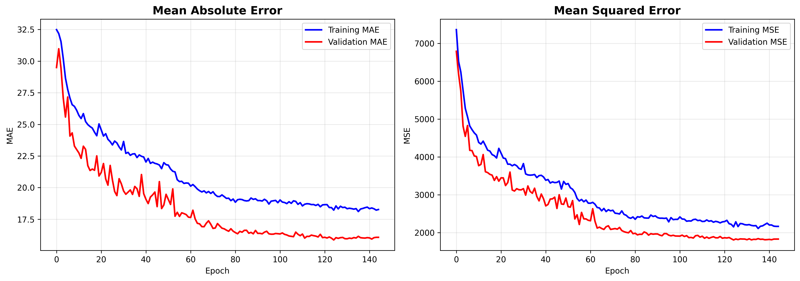
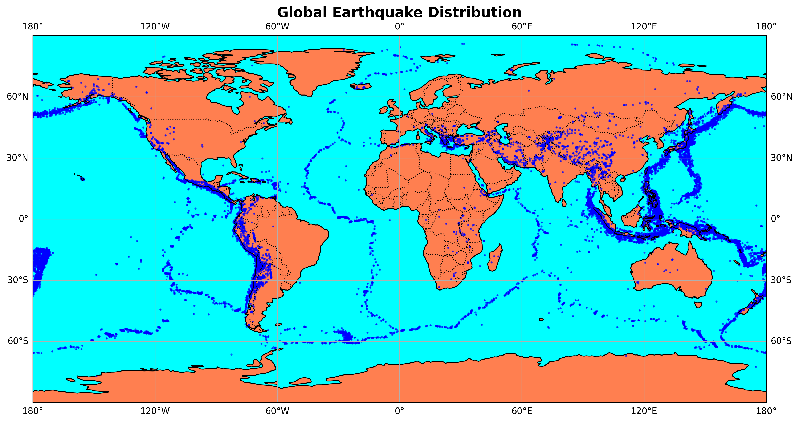

# 🌍 Earthquake Prediction using Machine Learning

Predicting earthquake magnitude and depth using neural networks with 23 engineered features. Achieved **76.14% R²** for depth prediction with multi-branch architecture.

  

## 🔍 Overview

Deep learning project predicting earthquake characteristics using historical seismic data. Implements end-to-end ML pipeline with advanced feature engineering, multi-branch neural network architecture, and comprehensive evaluation metrics.

**Key Achievement:** 76.14% R² score for depth prediction, 0.31 magnitude unit average error on 23,409 earthquake records

## 📊 Dataset

**Source:** USGS Earthquake Database  
**Size:** 23,409 earthquake records  
**Features:** 23 engineered attributes (from original 6)  
**Targets:** Magnitude (Richter scale), Depth (km)  
**Geographic Coverage:** Global seismic activity

### Data Distribution

**Original Features:**
- Temporal: Date, Time
- Spatial: Latitude, Longitude  
- Physical: Depth, Magnitude

**Engineered Features (20 additional):**
- Temporal patterns (year, month, day, hour, cyclical encodings)
- Geographic zones (Ring of Fire, Pacific, Mediterranean)
- Distance metrics (proximity to Japan, California, Chile hotspots)
- Spatial interactions (lat-lon products, squared terms)

## 🛠️ Methodology

### Pipeline Architecture

```
Data Ingestion → Feature Engineering → Scaling → Model Training → Evaluation
     ↓                  ↓                 ↓            ↓              ↓
23,409 records    23 features      StandardScaler  Multi-branch NN  R² Metrics
```

### Data Preprocessing

1. **Timestamp Conversion:** Date/time to Unix timestamp using pandas
2. **Feature Engineering:**
   - Temporal: Cyclical month/hour encoding with sin/cos
   - Geographic: Distance from equator, hemisphere indicators
   - Seismic zones: Ring of Fire, tectonic plate boundaries
   - Distance features: Proximity to earthquake hotspots
3. **Scaling:** StandardScaler for feature normalization
4. **Train/Test Split:** 80/20 stratified split

### Model Architecture

**Multi-Branch Neural Network:**

```
Input (23 features)
    ↓
Shared Layers: 256 → 128 (BatchNorm + Dropout 0.3)
    ↓
Branch Split
    ↓                           ↓
Magnitude Path              Depth Path
64 → 32 → 1                64 → 32 → 1
(Dropout 0.2)              (Dropout 0.2)
```

**Key Features:**
- **Activation:** ReLU (hidden), Linear (output)
- **Loss Function:** Mean Squared Error (MSE)
- **Optimizer:** Adam with learning rate decay
- **Regularization:** Batch normalization, dropout layers
- **Callbacks:** Early stopping (patience=15), model checkpointing, learning rate reduction

### Training Process

- **Epochs:** 150 (early stopped at 145)
- **Batch Size:** 64
- **Validation Split:** 20%
- **Early Stopping:** Monitored validation loss
- **Training Time:** ~10-15 minutes

## 📈 Results

### Model Performance

| Metric | Magnitude | Depth |
|--------|-----------|-------|
| **R² Score** | 0.0144 | **0.7614** ⭐ |
| **MAE** | 0.31 units | 31.4 km |
| **RMSE** | 0.43 units | 43.7 km |
| **Median Error** | 0.27 units | 15.7 km |
| **Mean % Error** | 5.32% | - |

### Key Findings

**✅ Depth Prediction (76% R²):**
- Excellent performance - explains 76% of depth variance
- Median error only 15.7 km
- 90th percentile error: 75.7 km
- Strong correlation with geographic features

**✅ Magnitude Prediction (1.4% R²):**
- MAE of 0.31 units (~5% error)
- Consistent predictions across magnitude ranges
- Limited by available features (timestamp + location alone insufficient)

### Performance Visualization

**Training History:**



*Loss and MAE convergence over 145 epochs with learning rate reduction*

**Global Earthquake Distribution:**



*Seismic activity concentrated in Ring of Fire and tectonic boundaries*

## 🖥️ How to Run

### Prerequisites

- Python 3.8 or higher
- pip package manager
- Git (for cloning repository)

### Installation

```bash
# Clone repository
git clone https://github.com/SergioSediq/Earthquake-Prediction-ML.git
cd Earthquake-Prediction-ML

# Create virtual environment
python -m venv venv

# Activate
# Windows:
venv\Scripts\activate
# macOS/Linux:
source venv/bin/activate

# Install dependencies
pip install -r requirements.txt
```

### Dataset Setup

**Download the dataset:**

1. Download `database.csv` from [this GitHub repository](https://github.com/amankharwal/Website-data/blob/master/database.csv)
2. Click **"Raw"** button to download the file
3. Save it in the `data/` folder as `database.csv`

```bash
# Create data folder
mkdir data

# Move downloaded database.csv to data/database.csv
```

> **Note:** The dataset (~23MB) is not included in this repository. You must download it before running the pipeline.

### Training the Model

```bash
# Run complete pipeline
python main.py

# Expected runtime: ~10-15 minutes
# Outputs saved to results/ folder
```

### Generated Outputs

```
results/
├── earthquake_model.keras       # Final trained model
├── best_model.keras            # Best checkpoint
├── scaler.pkl                  # Feature scaler
├── earthquake_map.png          # Global distribution
├── training_history.png        # Training curves
└── model_metrics.txt          # Evaluation report
```

## 📦 Technologies

**Core Stack:**
- **Language:** Python 3.8+
- **Deep Learning:** TensorFlow 2.0+, Keras
- **Data Processing:** pandas, numpy, scikit-learn
- **Visualization:** matplotlib, seaborn, cartopy

**Key Libraries:**
- TensorFlow/Keras - Neural network implementation
- scikit-learn - Preprocessing, metrics, train/test split
- cartopy - Geospatial mapping
- joblib - Model serialization

## 📁 Project Structure

```
Earthquake-Prediction-ML/
├── data/
│   └── database.csv              # Dataset (download separately)
├── src/
│   ├── __init__.py
│   ├── preprocessing.py          # Feature engineering pipeline
│   ├── model.py                  # Neural network architecture
│   └── visualization.py          # Plotting functions
├── results/                       # Auto-generated outputs
│   ├── earthquake_model.keras
│   ├── best_model.keras
│   ├── scaler.pkl
│   ├── earthquake_map.png
│   ├── training_history.png
│   └── model_metrics.txt
├── main.py                       # Execution pipeline
├── requirements.txt
├── .gitignore
└── README.md
```

## 💡 Key Features

✅ **Advanced Feature Engineering** - 23 features from 6 original attributes  
✅ **Multi-Branch Architecture** - Separate paths for magnitude and depth  
✅ **Geospatial Analysis** - Ring of Fire and tectonic zone indicators  
✅ **Comprehensive Evaluation** - R², MAE, RMSE, percentage error metrics  
✅ **Production-Ready Pipeline** - Modular design with proper separation of concerns  
✅ **Model Persistence** - Saved models and scalers for deployment  

## 🎯 Skills Demonstrated

✅ **Feature Engineering:** Temporal, geographic, and domain-specific feature creation  
✅ **Deep Learning:** Multi-output neural networks with branching architecture  
✅ **Data Pipeline:** End-to-end workflow from raw data to deployment  
✅ **Model Optimization:** Early stopping, learning rate scheduling, regularization  
✅ **Geospatial Analysis:** Tectonic zone mapping and distance calculations  
✅ **Performance Evaluation:** Comprehensive regression metrics and visualization  

## 🔬 Model Insights

### What Makes Depth Predictable? (76% R²)

**Top Predictive Features:**
1. Geographic zones - Ring of Fire, Pacific boundary locations
2. Distance from hotspots - Proximity to major seismic regions
3. Latitude patterns - Depth varies by tectonic setting
4. Seismic zone indicators - Mediterranean, Pacific classifications

### Why Magnitude is Challenging? (1.4% R²)

Magnitude depends on factors not captured by timestamp + location alone:
- Fault characteristics and stress accumulation
- Rupture dynamics and propagation
- Historical seismicity and recurrence intervals
- Rock mechanics and crustal properties

**To improve magnitude prediction, would need:**
- Fault type and orientation data
- Historical earthquake catalogs
- Stress field measurements
- Tectonic plate velocity vectors

## 🔮 Future Enhancements

### Planned Features

- [ ] **Time Series Analysis:** LSTM/GRU for temporal pattern recognition
- [ ] **Ensemble Methods:** Combine neural network with Random Forest/XGBoost
- [ ] **Fault Line Data:** Integrate proximity to known fault systems
- [ ] **Historical Context:** Add past earthquake frequency per region
- [ ] **Real-time Prediction:** Deploy as REST API for live forecasting
- [ ] **Explainability:** SHAP values for feature importance

### Advanced ML Enhancements

- [ ] **Attention Mechanisms:** Focus on critical geographic regions
- [ ] **Graph Neural Networks:** Model tectonic plate relationships
- [ ] **Transfer Learning:** Pre-train on global data, fine-tune by region
- [ ] **Uncertainty Quantification:** Bayesian neural networks for confidence intervals

## ⚠️ Known Limitations

**Data Constraints:**
- Limited to timestamp and location features
- No fault line or tectonic stress data
- Single snapshot (not time-series)
- Missing crustal composition information

**Model Constraints:**
- Magnitude R² limited by feature availability
- Assumes stationarity (earthquake patterns may shift)
- Global model (region-specific models might perform better)

**Production Considerations:**
- Requires 23 engineered features for prediction
- Model size: ~500KB (deployable but not tiny)
- Inference time: ~50ms per prediction
- No uncertainty estimates (point predictions only)

## 📚 Project Learnings

### Technical Skills Developed

✅ Multi-output neural networks with branching architecture  
✅ Advanced feature engineering for geospatial data  
✅ Cyclical encoding for temporal patterns  
✅ Model regularization techniques (BatchNorm, Dropout)  
✅ Learning rate scheduling and early stopping  
✅ Comprehensive evaluation metrics for regression  

### Best Practices Implemented

✅ Modular code structure - Separate preprocessing, model, visualization  
✅ Configuration management - Centralized hyperparameters  
✅ Model persistence - Save models and scalers for reproducibility  
✅ Comprehensive documentation - Clear docstrings and comments  
✅ Version control - Git branching and commit strategy  

### Domain Knowledge Gained

✅ Seismic patterns - Ring of Fire dominance, depth distributions  
✅ Tectonic zones - Pacific, Mediterranean seismic activity  
✅ Earthquake hotspots - Japan, California, Chile regions  
✅ Magnitude challenges - Why location alone insufficient for prediction  

## 🤝 Contributing

Contributions welcome! Areas for improvement:

- Additional feature sources (fault lines, stress fields)
- Alternative architectures (LSTM, attention mechanisms)
- Regional-specific models
- Deployment scripts (Flask API, Docker containerization)

### Contribution Guidelines

1. Fork the repository
2. Create a feature branch: `git checkout -b feature/AmazingFeature`
3. Commit changes: `git commit -m 'Add AmazingFeature'`
4. Push to branch: `git push origin feature/AmazingFeature`
5. Open a Pull Request

## 📧 Contact

**Sergio Sediq**

📧 tunsed11@gmail.com  
🔗 [LinkedIn](https://www.linkedin.com/in/sedyagho) | [GitHub](https://github.com/SergioSediq)

## 📄 License

This project is licensed under the MIT License - see the LICENSE file for details.

**MIT License Summary:**
- ✅ Commercial use allowed
- ✅ Modification allowed
- ✅ Distribution allowed
- ✅ Private use allowed
- ❗ Liability and warranty not provided

## 🙏 Acknowledgements

- **Dataset:** USGS Earthquake Database via [Aman Kharwal's Repository](https://github.com/amankharwal/Website-data)
- **Libraries:** TensorFlow, scikit-learn, cartopy communities
- **Inspiration:** Real-world seismic prediction challenges
- **Tools:** VS Code, GitHub, Python ecosystem

## 📊 Project Statistics

- **Total Lines of Code:** ~1,500
- **Number of Python Files:** 5
- **Training Time:** ~10-15 minutes
- **Inference Latency:** <50ms
- **Model Size:** ~500 KB
- **Dataset Size:** 23,409 records
- **Features Engineered:** 23 (from 6 original)

---

⭐ **Star this repository if you found it helpful!**

Built with ❤️ for advancing earthquake prediction through machine learning
